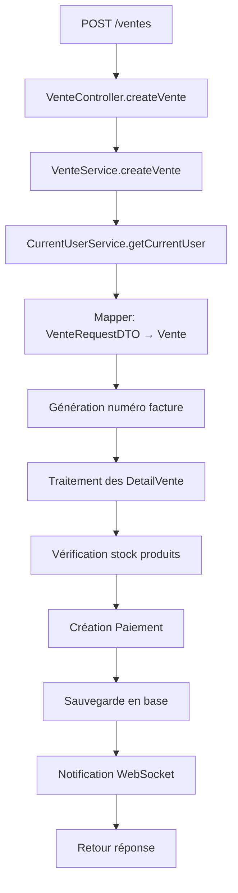

# 🛒 Analyse Complète du Système de Vente

## 📊 **Comment fonctionne la vente ?**

### 🔄 **Flow de Création d'une Vente**



### 🏗️ **Processus Détaillé**

#### **1. Réception de la requête**
```java
POST /ventes
Content-Type: application/json
{
  "detailVenteList": [
    {
      "produitId": 1,
      "prixVente": 1000.0,
      "quantiteVendu": 2
    }
  ],
  "modePaiement": "ESPECE"
}
```

#### **2. Traitement dans VenteService**
1. **Mapping DTO → Entity** : `VenteRequestDTO` → `Vente`
2. **Auto-assignation utilisateur** : `currentUserService.getCurrentUser()`
3. **Génération numéro facture** : `FAC-18-09-25-0001`
4. **Traitement des détails** :
   - Vérification existence produit
   - Contrôle stock disponible
   - Mise à jour stock
   - Création `DetailVente`
5. **Création paiement automatique**
6. **Sauvegarde cascade** : Vente → DetailVentes → Paiements
7. **Notification temps réel** via WebSocket

#### **3. Structure des Entités**

```
Vente (1) ←→ (N) DetailVente ←→ (1) Produit
  ↓
  (N) Paiement
  ↓
  (1) Utilisateur
  ↓
  (0..1) Client
```

---

## 📋 **Analyse des DTOs**

### ✅ **DTOs UTILISÉS (À CONSERVER)**

| DTO | Utilisation | Statut |
|-----|-------------|--------|
| `VenteRequestDTO` | Input création vente | ✅ **UTILISÉ** |
| `DetailVenteRequestDTO` | Input détails vente | ✅ **UTILISÉ** |
| `VenteJourResponseDTO` | Output liste ventes | ✅ **UTILISÉ** |
| `ProduitVenteResponseWebDTO` | Output produits web | ✅ **UTILISÉ** |
| `ProduitVenteResponseMobileDTO` | Output produits mobile | ✅ **UTILISÉ** |

### ❌ **DTOs NON UTILISÉS (À SUPPRIMER)**

| DTO | Raison | Action |
|-----|--------|--------|
| `VenteJourPageResponseDTO` | Jamais référencé dans le code | 🗑️ **SUPPRIMER** |

---

## 🔍 **Vérification d'Utilisation**

### **VenteJourPageResponseDTO** - ❌ NON UTILISÉ
```java
// Fichier : VenteJourPageResponseDTO.java
@Data
public class VenteJourPageResponseDTO {
    private List<VenteJourResponseDTO> content;
    private Double totalAmount;
}
```

**Recherche dans le codebase :**
- ❌ Aucune référence dans les contrôleurs
- ❌ Aucune référence dans les services  
- ❌ Aucune référence dans les mappers
- ❌ Aucune utilisation détectée

**Remplacement :** Le système utilise directement `Page<VenteJourResponseDTO>` avec une `Map<String, Object>` personnalisée dans `VenteController.buildResponseMap()`

---

## 🧹 **Nettoyage Requis**

### **Fichier à supprimer :**
- ✅ `VenteJourPageResponseDTO.java` - Complètement inutilisé

### **Fichiers à conserver :**
- ✅ Tous les autres DTOs sont activement utilisés
- ✅ Architecture cohérente et optimisée
