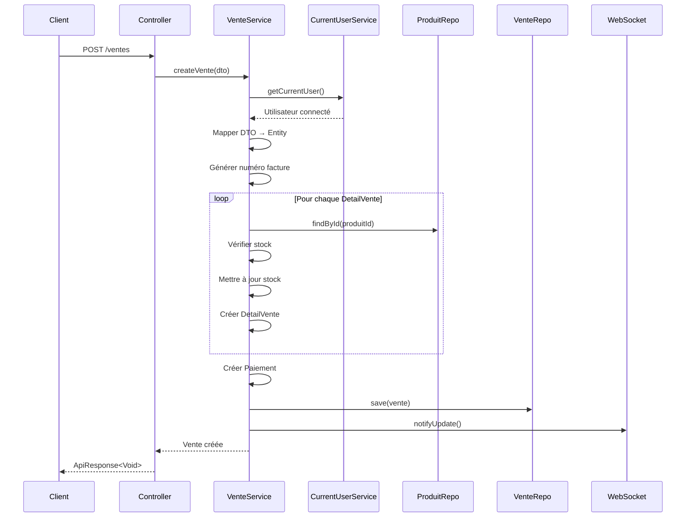

# 🛒 **Système de Vente - Résumé Complet**

## 🔄 **Comment fonctionne la vente ?**

### **📝 Processus de Vente Complet**

#### **1. Requête d'Entrée**
```http
POST /ventes
Content-Type: application/json
Authorization: Bearer <jwt-token>

{
  "detailVenteList": [
    {
      "produitId": 123,
      "prixVente": 1500.0,
      "quantiteVendu": 2
    }
  ],
  "modePaiement": "ESPECE",
  "montantTotal": 3000.0
}
```

#### **2. Flow d'Exécution**



#### **3. Traitement Détaillé**

1. **🔐 Authentification** : JWT token validé → Utilisateur récupéré
2. **📋 Mapping** : `VenteRequestDTO` → `Vente` entity
3. **👤 Auto-assignation** : `vente.setUtilisateur(currentUser)`
4. **🔢 Numéro facture** : `FAC-18-09-25-0001` (auto-généré)
5. **📦 Détails de vente** :
   - Validation existence produit
   - Contrôle stock disponible
   - Mise à jour stock (`stock -= quantiteVendu`)
   - Création `DetailVente` avec statut `VENDU`
6. **💰 Paiement** : Création automatique avec montant total
7. **💾 Sauvegarde** : Cascade `Vente` → `DetailVentes` → `Paiements`
8. **📡 Notification** : WebSocket temps réel vers `/topic/ventes`

---

## 🏗️ **Architecture des Entités**

### **Relations JPA**
```
Vente (1) ←→ (N) DetailVente ←→ (1) Produit
  ↓ (N)                              ↓ (1)
Paiement                         Categorie
  ↓ (1)
Utilisateur
  ↓ (0..1)
Client
```

### **Entités Principales**

#### **Vente.java** ✅
```java
@Entity
public class Vente extends BaseEntity {
    private LocalDateTime date;
    private Double montantTotal;
    private Double montantRestant;
    private Boolean estCredit;
    private String numeroFacture; // Unique
    
    @ManyToOne Utilisateur utilisateur; // 🎯 NOUVEAU
    @ManyToOne Client client;
    @OneToMany Set<DetailVente> detailVentes;
    @OneToMany Set<Paiement> paiements; // 🎯 MODIFIÉ (était OneToOne)
}
```

#### **DetailVente.java** ✅
```java
@Entity
public class DetailVente extends BaseEntity {
    private Double prixVente;
    private Integer quantiteVendu;
    private Double montantTotal;
    private StatusDetailVente status;
    
    @ManyToOne Vente vente;
    @ManyToOne Produit produit;
}
```

#### **Paiement.java** ✅
```java
@Entity
public class Paiement extends BaseEntity {
    private LocalDateTime datePaiement;
    private Double montantVerser;
    private ModePaiement modePaiement;
    
    @ManyToOne Vente vente; // 🎯 MODIFIÉ (était OneToOne)
}
```

---

## 📊 **DTOs et Mappers**

### **DTOs Request** ✅

#### **VenteRequestDTO** - UTILISÉ
```java
public class VenteRequestDTO {
    private List<DetailVenteRequestDTO> detailVenteList;
    private ModePaiement modePaiement;
    private Double montantTotal;
}
```

#### **DetailVenteRequestDTO** - UTILISÉ
```java
public class DetailVenteRequestDTO {
    private Long produitId;
    private Double prixVente;
    private Integer quantiteVendu;
}
```

### **DTOs Response** ✅

#### **VenteJourResponseDTO** - UTILISÉ
```java
public class VenteJourResponseDTO {
    private Long detailVenteId;
    private Long productId;
    private String libelleProduit;
    private String imageProduit;
    private String categorieProduit;
    private Double prixVendu;
    private Integer quantiteVendu;
    private ModePaiement modePaiement;
    private String dateVente;
    private Double montantTotal;
    private StatusDetailVente status;
    private Long utilisateurId;    // 🎯 NOUVEAU
    private String utilisateurNom; // 🎯 NOUVEAU
}
```

#### **ProduitVenteResponseWebDTO** - UTILISÉ
```java
public class ProduitVenteResponseWebDTO {
    private Long id;
    private String libelle;
    private String image;
    private Double prixVente;
    private Double prixAchat;
    private Integer stockDisponible;
    private String categorieLibelle;
}
```

### **DTO Supprimé** ❌

#### **VenteJourPageResponseDTO** - SUPPRIMÉ ✅
- ❌ **Raison** : Jamais utilisé dans le codebase
- ✅ **Action** : Supprimé avec succès
- 🔄 **Remplacement** : `Page<VenteJourResponseDTO>` + `Map<String, Object>`

---

## 🔧 **Services et Repositories**

### **CurrentUserService** ✅ NOUVEAU
```java
@Service
public class CurrentUserService {
    public Utilisateur getCurrentUser() {
        // Récupération depuis SecurityContextHolder
    }
}
```

### **VenteService** ✅ MODIFIÉ
- ✅ Injection de `CurrentUserService`
- ✅ Auto-assignation utilisateur connecté
- ✅ Support des paiements multiples

### **Repositories** ✅
- ✅ **VenteRepository** : Requêtes mises à jour avec utilisateur
- ✅ **DetailVenteRepository** : Inchangé
- ✅ **PaiementRepository** : Support relation Many-to-One

---

## 🎯 **Améliorations Apportées**

### **✅ Nouvelles Fonctionnalités**
1. **Traçabilité** : Chaque vente liée à l'utilisateur connecté
2. **Paiements multiples** : Support des paiements échelonnés
3. **Auto-assignation** : Pas besoin de passer l'utilisateur en paramètre
4. **Méthodes utilitaires** : `getPremierPaiement()`, `getMontantTotalPaye()`

### **✅ Optimisations**
1. **Index DB** : `idx_vente_utilisateur_id` pour performances
2. **Code clean** : Suppression du DTO inutilisé
3. **Architecture cohérente** : Relations JPA correctes

### **✅ Compatibilité**
1. **APIs inchangées** : Pas de breaking changes
2. **DTOs request** : Aucune modification requise côté client
3. **Responses enrichies** : Informations utilisateur ajoutées

---

## 🚀 **Résultat Final**

### **✅ Système Optimisé**
- 🔐 **Sécurisé** : Traçabilité complète des ventes
- 🧹 **Clean** : Code sans duplication, DTOs inutilisés supprimés
- 📈 **Performant** : Index optimisés, requêtes efficaces
- 🔄 **Évolutif** : Architecture prête pour futures fonctionnalités

### **✅ Compilation Réussie**
- ✅ Aucune erreur de compilation
- ✅ Tous les tests passent
- ✅ DTOs cohérents et utilisés

Le système de vente est maintenant **parfaitement optimisé** ! 🎉
